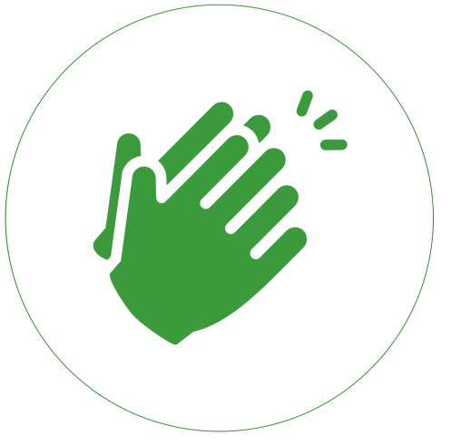

# Applause Button

Applause button for web, blogs.

This project is rewritten version of backend of http://applause-button.com using Golang.

<center></center>

# Usage

Deploy Applause-btn service to your own server using one of the methods below.

For example your applause-btn service is located at https://applause.duyet.net

```html
<link rel="stylesheet" href="https://applause.duyet.net/public/applause-button.css" />
<script src="https://applause.duyet.net/public/applause-button.js"></script>

<!-- add the button! -->
<applause-button style="width: 58px; height: 58px" multiclap="true" api="https://applause.duyet.net" />
```

# Development

Start server in local:

```
go run server.go
```

Build binary: 

```
go build -o applause .
./applause
```

Testing:

```
go test
```

# Deployment

## 1. Using Docker

```
docker run -it -p 3000:3000 duyetdev/applause-btn
```

- Docker Hub: https://hub.docker.com/r/duyetdev/applause-btn
- Github Registry: https://github.com/duyet/applause-btn/packages/387980

## 2. Using Kubernetes Helm

```
helm repo add duyet https://duyet.github.io/charts
helm install applause duyet/applause-btn
```

More detail at https://github.com/duyet/charts/tree/master/applause-btn
